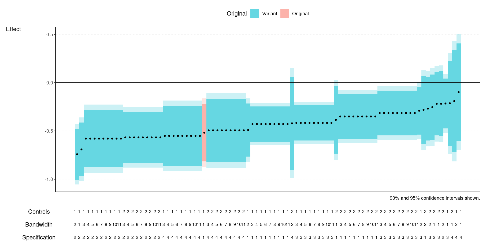

# r2especcurve
A specification curve builder for the R2E project. Uses the data format generated by following the [R2E reproduction protocol](https://github.com/NickCH-K/r2especcurve/blob/main/Data%20Submission_R2E.pdf).



If you are an R user, to use:

1. Do `remotes::install_github('NickCH-K/r2especcurve')`
2. Load up your data and `library(r2especcurve)`.
3. See `help(spec_curve)` for example code (or see below in the Stata section). You'll need to give it your data set and the column names of your analytical decisions, at least. Optionally see `data(cholera_dat)` for an example of the proper data structure.

If you are a Stata user and do not want to install R:

1. Go to [RStudio Cloud](https://posit.cloud) and create a free account.
2. Click New Project -> New RStudio project
3. In the bottom-right panel, click "Upload" to upload your reproduction file which fits the R2E specifications. Note this assumes in particular that your outcome variable indicator is stored in a column called `outcome`, oyur effect is stored in a column called `beta` and your SEs in a column called `se` (case sensitive).
4. Run the below code by copy/pasting it into the console (this will take a while as it needs to install some packages). Be sure to change the `revised_reproduction_output.dta` to match your own filename. Also note that this will open up a help file on the specification curve function that you can use to adjust it if you like. If it asks if you want to compile packages from source, select "No."

```
install.packages(c('haven','remotes','data.table','ggplot2','patchwork','sjlabelled','vtable'))
remotes::install_github('NickCH-K/r2especcurve')
library(r2especcurve)

help(spec_curve)

dat = haven::read_dta('revised_reproduction_output.dta')
dat$outcome = sjlabelled::as_character(dat$outcome)
```

5. Run the below code to generate a specification curve graph. Be sure to change (a) the `outcome == 'outcome 3'` to match whatever outcome you want to make a specification curve for, (b) the `analytical_decision_1` (and so on) column names to match the columns that contain your analytic decisions, (c) the `Specification`, etc., labels for those decision columns, and (d) the `orig_spec_values` values to match the analytic decision values that match the original published study. 

Note that if you have the original values directly, you can replace `orig_spec_values = c(1,1,1)` with `orig_beta_se = c(.5, .2)` to indicate an original beta of .5 and a SE of .2, for example. Or remove it (and the preceding comma) entirely to leave the original off the graph.

```
spec_curve(dat[dat$outcome == 'outcome 3',],
           decision_cols = c('analytical_decision_1',
                             'analytical_decision_2',
                             'analytical_decision_3'),
           decision_labels = c('Specification',
                               'Bandwidth',
                               'Controls'),
           orig_spec_values = c(1,1,1))
```

6. Use the "Zoom" button to zoom in on the result, resize as you like, then right/command-click to save the image.
7. Repeat with your other outcomes.
8. You will notice that the analytical decision value below the table are indicated with numbers. If your data set contains labeled values from Stata, the values correspond to that labeling system. If your data set contains strings, the values have been set alphabetically. To create a table showing the correspondence between the values and the labels (whether they are Stata-labeled values or alphabetic), use the below code (similarly change the `decision_cols` and `decision_labels` settings). This will save the table as a "decision_label_table.csv" CSV. You can download this by: (a) in the bottom-right pane, clicking "Files", (b) clicking the checkbox by "decision_label_table.csv", (c) clicking the little gear icon to the top-right of the pane, (d) clicking "Export". Once you've downloaded it you can open it in Excel, copy it to Word, etc.

```
decision_label_table(dat,
			decision_cols = c('analytical_decision_1',
                             'analytical_decision_2',
                             'analytical_decision_3'),
			 decision_labels = c('Specification',
                               'Bandwidth',
                               'Controls'))
```
							 
9. As an additional note, if you want to add additional categories to the graph, for example original-paper robustness tests, you can do that with `additional_highlights_spec_values`, although the formatting is a bit complex. `additional_highlights_spec_values = list('Original Robustness' = list(c(1,2,1),c(2,1,1)))`, for example, would add an "Original Robustness" category for the analytic decision values 1, 2, 1 and 2, 1, 1. Or add multiple categories using multiple named lists, like `list('Original Robustness' = list(c(1,2,1),c(2,1,1), 'Placebo' = list(c(3,2,2,))))`. Similar to using `orig_beta_se` instead of `orig_spec_values`, you can use `additional_highlights_beta_se` instead of `additional_highlights_spec_values` by spcecifying the beta and se values you want instead of the original analytic decisions.
